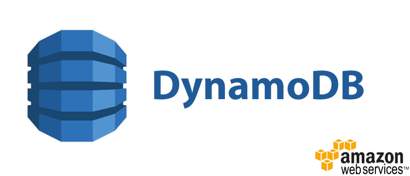
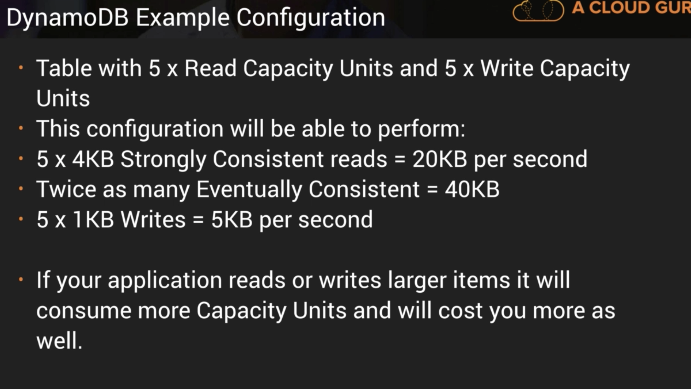
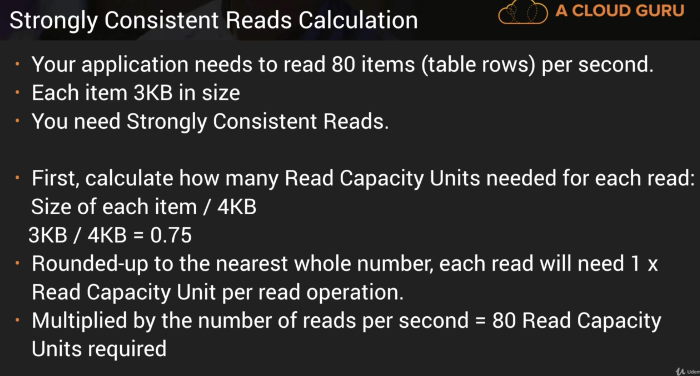
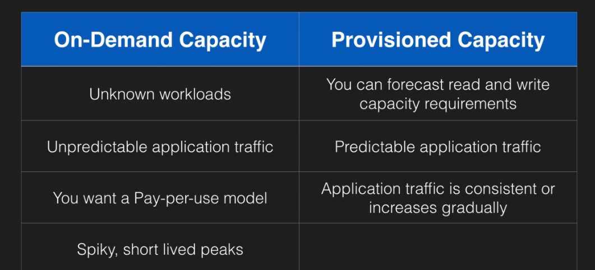
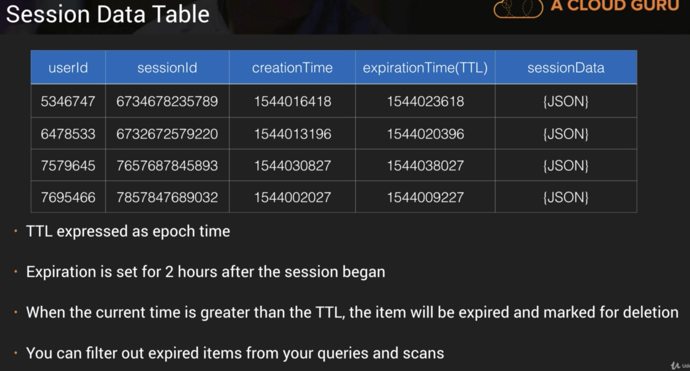

    

__O DynamoDB é a solução No-SQL da AWS. É um serviço rápido e flexível para aplicações que precisam baixa latência. É totalmente gerenciável e suporta tanto o modelo de dados chave-valor quanto o de documentos. Essa flexibilidade e a alta perfomance torna o DynamoDB ideal para aplicações web, games, internet das coisas, mobile e outros.__

> "NoSQL (originalmente se referindo a "no SQL": "não SQL" ou "não relacional", posteriormente estendido para Not Only SQL - Não Somente SQL) é um termo genérico que representa os bancos de dados não relacionais.[1] Uma classe definida de banco de dados que fornecem um mecanismo para armazenamento e recuperação de dados que são modelados de formas diferentes das relações tabulares usadas nos bancos de dados relacionais." -- [Wikipedia](https://pt.wikipedia.org/wiki/NoSQL)

## Principais características
- __Alta disponibilidade__
- Réplicas em 3 AZ
- Baixa latência (millisegundos, na casa de 1 dígito)
- Integração com o IAM para segurança, autorização e administração
- Baixo custo
- Escalável automaticamente
- Modelo de dados baseado em documento e chave-valor
- Base de dados total gerenciada
- Suporta milhões de requisições por segundo
- Suporta trilhões de linhas 
- Uso de SSD para armazenamento dos dados
- Capacidade de armazenamendo na ordem de centenas de Terabytes
- Recomendado para games, mobile, web, IoT...

- Usa armazenamento SSD
- Distribuido em 3 data centers geograficamente distintos (evita que 1 único ponto de falha quebre o serviço)
- 2 possibilidades de modelos de consistência
	- Eventual Consistent Reads (Default): A consistência de todas as cópias de dados ẽ alcanada geralmente em um segundo, de forma que repetir a leitura em um curto tempo deve retorna o dado jã atualizado. É considerado a melhor performance de leitura).
	- Strongly Consistent Reads: Retorna um resultado que reflete todas as operações de escritas que tiveram sucesso antes da operação de leitura.

## Estrutura

- O DynamoDB é estruturado em tabelas, items (linhas) e atributos (colunas). 
- Suporta dois modelos (ou estrutura de dados), key-value e documentos.
- A __Key__ é o nome do dado, enquanto __value__ é a informação armazenada em si. 
- Os documentos podem ser escritos em __JSON__, __HTML__ ou __XML__.
- Os dados são armazenados e acessados com base numa __chave primária__.
	- Há dois tipos de chave primãria:
		- Partition Key: deve ser um atributo que tenha valor único; é uma entrada para uma função interna de hash que determina a partição ou local físico onde o dado está armazenado.
		- Composition Key: é formada pela combinação de uma partition key e de uma sort key. Nesse caso, dois itens podem ter a mesma primary key, mas devem ter uma sort key diferente. 

## Controle de acesso

- Autenticação e controle de acesso gerenciado via AWS IAM.
	- Pode ser usado IAM Conditions para restrigir o acesso apenas aos registros pertencentes ao usuário (pela partition key)
	- O acesso pode ser feito via chaves temporárias obtidas por um IAM Role
	- Pode ser criado um usuário com permissões específicas para acesso e criação de tabelas 

## Indíces

- 2 tipos de indices são suportados:
	- Local Secondary Index
		- Só pode ser criada no momento que a tabela está sendo criada.
		- Tem a mesma Partition Key como tabela original, porém uma Sort Key diferente.
		- Permite a visualização dos dados numa organização de acordo com Sort Key alternativa.
		- As buscas baseadas nessa Sort Key são mais rápidas usando o indíce do que a tabela principal. (ex: Sort Key: account creation date)
		
	- Global Secondary Index
		- É mais flexível que a LCI, porque permite que seja criada tando no momento da criação da tabela quanto posteriormente.
		- Partition Key e Sofrt Key diferentes das Keys da tabela.
		- Possibilita uma visão completamente diferente dos dados.
		- Acelera qualquer busca relacionadas as Partition Key e Sort Key alternativas. (ex: PK - email; SK - last log-in date)

## Scan vs Query API Call

- Query
	- Encontra um item numa tabela, baseado na primary key.
	- É possível usar uma _sort key_ para refinar a busca.
	- Por padrão, a query retorna todos os atributos, mas pode-se usar o parâmetro ProjectionExpression se quiser especificar os atributos que deseja retornar.
	- Os resultados são ordenados pela _sort key_.
		- Ordem númerica - em ordem ascendente.
		- Valor do código ASCII.
		- A ordem pode ser invertida setando o parâmetro __ScanIndexForward__ para _false_.
	- Por padrão as Queries são do tipo __Eventually Consistent__.
		- É possível forçar a query para ser do tipo __Strongly Consistent__ setando isso explicitamente. 

- Scan
	- Operação que examina cada item da tabela.
	- Returna todos os atributos.
		- Pode-se usar o parâmetro ProjectionExpression se quiser especificar os atributos que deseja retornar.

- Diferenças e melhorias
	- Query é mais eficiente que o Scan.
	- Reduzir o impacto de uma Query ou Scan diminuindo o tamanho da página, de forma que ela necessite de menos operações de leitura.
	- Usar Scan em paralelo no lugar de executar sequecialmente.
	- Projetar tabelas que possam usar mais operações como Query, Get e BatchGetItems.
	
## Dynamo DB Provisioned Throughput

- É medido em Capacity Units.
- Esses requerimentos são especificados no momento da criação da tabela.
- 1 x Write Capacity Unit = 1 x 1KB de escrita por segundo.
- 1 x Read Capacity Unit = 1 x Strongly Consistent Read de 4KB por segundo; ou 2 x Eventually Consistent Reads de 4KB por segundo (Default).

    

Strongly Consistent Read Calculation:

    

Write Calculation

    

## DynamoDB On Demand Capacity

- Cobrança se aplica a leitura, escrita e armazenamento dos dados.
- Dispensa a necessidade de especificar seus requerimentos.
- Escala automaticamente com base na atividade da aplicação.
- Bom para um cenário em que não se sabe o nível de carga.
- Pagamento com base no que for usado (pay per request).
 

    

## DynamoDB Accelerator (DAX)

- É um cache _in-memory_ completamente gerenciado para o DynamoDB.
- Melhora em até 10x a performance de leitura.
- Performance na casa dos microssegundos para milhões de requisições por segundo.
- Ideal para aplicações com alto nível de operações de leitura e altas cargas de trabalho. (ex: sites de leilões, jogos, sites de comércio eletrônico na black friday)
- É um cache do tipo _write-through_, que performa escrita simultanea no cache e no banco.
- As chamadas da API do DynamoDB devem ser direcionadas para o cluster DAX.
- Se o item buscado estiver no cache, o resultado é diretamente retornado para a aplicação. Caso contrário (cache miss) uma operação __GetItem__, do tipo __Eventually Consistent__, é executada para buscar a informação no DynamoDB.
- O uso do DAX reduz a carga de leitura das tabelas e pode ser capaz de reduzir a Capacidade de Leitura Provisionada.

Não se encaixa bem para:
- Aplicações que requerem leituras do tipo _Strongly Consistent_.
- Aplicações com nível de escrita intenso.
- Aplicações com poucas operações de leitura.
- Aplicações que não requerem respostas rápidas (na casa dos microssegundos).

## Elasticache
- É um chache _in-memory_ para melhorar a performance das aplicações web, permitindo que as informações sejam acessadas diretamente de uma fonte rápida ao invés de acessar a base de dados em discos.
- É bom pra tirar o peso de carga da base de dados e se aplica bem se seu banco tem o nível muito alto de leitura e dados que não mudam com frequência.

Casos de uso:
- Motor de recomendação
- Armazenamento de resultados de consultas intensivas a banco de dados ou cálculos computacionais intensos.
- Dados acessados frequentemente são alocados em memória para reduzir a latência, melhorando a performance geral da aplicação.

Há dois tipos de Elasticache:
- Memcached
	- Memory Object Caching System
	- Multi-threaded
	- Sem capacidade Multi-AZ
- Redis
	- Banco de dados do tipo chave-valor baseado em memória.
	- Suporta estruturas de dados complexas, como listas e sets ordenados.
	- Suporta replicação Master / Slave e Multi-AZ para redundância.

Estratégias de Caching
- Lazy Loading
	- Só carrega os dados para o cache quando necessário.
	- Se o dado já se encontrar no cache, são retornados imediatamente para aplicação.
	- Caso os dados não estejam no cache ou estejam expirados, o Elasticache retorna _null_.
	- Nesse último caso, a aplicação vai buscar os dados na base de dados e os dados recebidos são escritos no cache para estarem disponíveis numa próxima vez.
	- Vantagens:
		- Só contém dados requisitados, para evitar cachear dados desnecessários.
		- Falhas não são fatais, um novo nó vazio vai apenas ter um monte de dados não cacheados anteriormente.
	- Desvantagens:
		- Requisição inicial bate na base de dados para escrever dados no cache.
		- Dados desatualizados (Stale data) 
	- TTL
		- Especifica o tempo de vida da informação (em segundos) para evitar que informação desatualizada seja mantida no cache.
		- O Lazy Loading trata uma informação expirada como um _cache miss_, assim força a aplicação ir buscar a informação na base de dados, gravando-a no cache com um novo TTL.
		- Não elimina _stale data_, mas ajuda a evitá-los.

- Write-Through
	- Adiciona ou atualiza dados no cache sempre que um dado é escrito na base de dados.
	- Vantagens:
		- Dados no cache nunca desatualizam.
		- Usuários são mais tolerantes a maior latência quando atualizando do que quando consultando dados.
	- Desvantagems:
		- Toda operação de escrita consiste numa escrita no banco e outra no cache.
		- Em caso de falha, dados estarão faltando no cache até que eles sejam inseridos ou atualizados na base de dados.
			- Pode ser mitigado usando Lazy Loading junto com Write-Through.
		- Representa desperdício de recursos se a maioria dos dados nunca são lidos.

## DynamoDB Transactions

- Transações ACID.
- Lê ou escreve multiplos itens para multiplas tabelas, na forma de operações _tudo ou nada_.
- Verifica condições de pré requisitos antes de escrever na tabela.

## DynamoDB TTL
- Define tempo de expiração para os dados.
- Dados expirados são marcados para deleção. (48h para deleção)
- É bom para remover dados irrelevantes ou desatualizados:
	- Dados de sessão, logs de eventos e dados temporários.
- Reduz os custo já que elimina automaticamente dados irrelevantes.

Exemplo TTL em Session Data:

    

## DynamoDB Streams

- Sequência baseada em tempo de modificações de nível de item (insert, update e delete).
- Os logs são encriptados em repouso e armazenados por 24h.
- Podem ser acessados por um endpoint específico.
- Por padrão a Primary Key é registrada.
- Imagens de Antes e Depois podem ser capturadas. (Permite ter o estado antes e depois de uma mudança ocorrer)
- Os eventos são gravados muito próximo do tempo real em que ocorrem.
- As aplicações podem executar ações baseadas no conteúdo.
- Podem ser fonte de evento para Lambdas.
- Lambdas pode controlar o stream. 
- Executa Lambda baseado em um evento do Dynamo Streams.

## Provisioned Throughput Exceeded & Exponential Backoff
- ProvisionedThroughputExceededException.
- Acontece quando a taxa de requisição de leitura ou escrita é maior que a capacidade provisionada na tabela.
- O SDK vai reenviar as requisições automaticamente até que elas sejam bem sucedidas.
	- Se não estiver usando o SDK você pode reduzir a frequência de requisição ou usar o Exponential Backoff.

- Elasticache ou Dax podem ser usados para melhorar esse problema.

## Dicas para o exame:

- 

